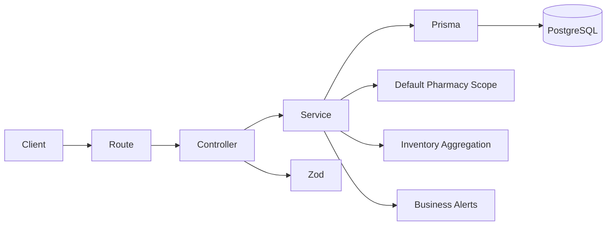

# 🚀 Pharma Stock Manager

[]()
[]()
[]()

Fullstack project simulating a pharmacy inventory management system, designed to reflect **real-world production practices**.

> 🎯 Goal: showcase strong backend fundamentals, domain modeling, testing strategy, CI/CD, deployment workflow, and production-oriented architecture.

---

## 🧠 Business Context

This project is inspired by real pharmacy inventory challenges:

- 💊 Prevent medicine stock shortages
- ⏳ Track expiration dates per physical stock batch
- 📊 Ensure reliable inventory data for operational decisions
- 🚨 Detect stock and expiration risks early
- 🏥 Prepare the application for multi-pharmacy inventory management
- 🔎 Prepare future public medicine availability search across pharmacies

➡️ Focus: **business logic + engineering quality + scalable domain modeling**

---

## 🛠️ Tech Stack

**Backend**

- Node.js + TypeScript
- Express
- Prisma ORM
- PostgreSQL (Supabase)
- Zod

**Frontend**

- React
- Vite
- TypeScript
- CSS

**Testing**

- Vitest
- Supertest
- React Testing Library
- Docker (isolated PostgreSQL DB for integration tests)

**DevOps**

- GitHub Actions
- Vercel
- Docker
- Manual production migration workflow
- Database migration reminder workflow
- Protected `main` branch / PR-based workflow

---

## 🧩 Domain Model

The inventory model is now structured around pharmacy-specific stock management.

The main concepts are:

```txt
Pharmacy
└─ PharmacyMedicine
   ├─ MedicineProduct
   └─ MedicineBatch
```

---

### Pharmacy

A `Pharmacy` represents a pharmacy location.

A pharmacy contains:

- `id`
- `name`
- `email`
- `address`
- `city`
- `zipCode`
- `country`
- timestamps

The address fields prepare the application for future map-based public search.

Example future use case:

```txt
A public user searches for Doliprane
→ the app can show pharmacies that have it in stock
→ later, the app can display pharmacies on a map or sort by distance
```

---

### MedicineProduct

A `MedicineProduct` represents the global medicine catalog item.

Examples:

- Doliprane
- Ibuprofene
- Amoxicillin

A product contains:

- `id`
- `name`
- timestamps

Important: `MedicineProduct` does **not** contain the stock threshold anymore.

Why?

A medicine product is global, but a stock threshold is local to each pharmacy.

Example:

```txt
Pharmacy A may need at least 50 Doliprane units.
Pharmacy B may only need 10 Doliprane units.
```

---

### PharmacyMedicine

A `PharmacyMedicine` represents a medicine tracked by a specific pharmacy.

It links:

```txt
Pharmacy + MedicineProduct
```

and contains the pharmacy-specific inventory configuration:

- `id`
- `pharmacyId`
- `medicineProductId`
- `threshold`
- timestamps

This allows each pharmacy to define its own threshold for the same global medicine product.

Example:

```txt
MedicineProduct: Doliprane

Pharmacy A
└─ Doliprane threshold = 50

Pharmacy B
└─ Doliprane threshold = 10
```

A pharmacy cannot track the same medicine twice because the backend enforces a unique relation between:

```txt
pharmacyId + medicineProductId
```

---

### MedicineBatch

A `MedicineBatch` represents a physical stock batch linked to a `PharmacyMedicine`.

A batch contains:

- `id`
- `pharmacyMedicineId`
- `quantity`
- `expirationDate`
- timestamps

This design allows one pharmacy medicine to have multiple batches, each with its own quantity and expiration date.

Example:

```txt
Default Pharmacy
└─ Doliprane
   ├─ Batch 1: quantity 10, expires 2026-06-30
   ├─ Batch 2: quantity 25, expires 2026-09-15
   └─ Batch 3: quantity 5, expires 2026-12-01
```

The inventory total quantity is computed from all batches linked to the same `PharmacyMedicine`.

---

## 🏥 Temporary Default Pharmacy

Authentication is not implemented yet.

To keep the application usable while preparing the future multi-pharmacy model, the backend currently uses a **default pharmacy** internally.

Temporary behavior:

- New tracked medicines are linked to the default pharmacy
- Inventory is computed for the default pharmacy
- Alerts are computed for the default pharmacy
- Future authentication will replace this with the logged-in user’s pharmacy

Future behavior:

```txt
Current temporary logic:
getDefaultPharmacy()

Future authenticated logic:
req.user.pharmacyId
```

This makes the current architecture ready for role-based access without blocking the project now.

---

## ✨ API

### Health

```http
GET /health
```

Response:

```json
{
  "status": "ok"
}
```

---

### Track medicine in pharmacy

```http
POST /pharmacy/medicines
```

Creates a medicine tracked by the current pharmacy with a pharmacy-specific alert threshold.

If the global `MedicineProduct` does not already exist, it is created automatically.

Body:

```json
{
  "name": "Doliprane",
  "threshold": 10
}
```

Response:

```json
{
  "id": "pharmacyMedicineUuid",
  "medicineProductId": "medicineProductUuid",
  "name": "doliprane",
  "threshold": 10,
  "createdAt": "...",
  "updatedAt": "..."
}
```

Notes:

- The name is normalized before persistence.
- `id` is the `PharmacyMedicine` id.
- `medicineProductId` is the global catalog product id.
- The same pharmacy cannot track the same medicine twice.
- Duplicate tracked medicines return `409 Conflict`.

---

### List tracked medicines for pharmacy

```http
GET /pharmacy/medicines
```

Returns the medicines tracked by the current pharmacy.

Response:

```json
[
  {
    "id": "pharmacyMedicineUuid",
    "medicineProductId": "medicineProductUuid",
    "name": "doliprane",
    "threshold": 10,
    "createdAt": "...",
    "updatedAt": "..."
  }
]
```

---

### Create medicine batch

```http
POST /pharmacy/medicines/:pharmacyMedicineId/batches
```

A batch represents a physical stock entry for a medicine tracked by the pharmacy.

Body:

```json
{
  "quantity": 50,
  "expirationDate": "2026-06-30"
}
```

Response:

```json
{
  "id": "batchUuid",
  "pharmacyMedicineId": "pharmacyMedicineUuid",
  "quantity": 50,
  "expirationDate": "2026-06-30T00:00:00.000Z",
  "createdAt": "...",
  "updatedAt": "..."
}
```

Notes:

- If the pharmacy medicine does not exist, the API returns `404 Not Found`.
- Batch quantity and expiration date are validated before persistence.
- The batch is linked to `PharmacyMedicine`, not directly to `MedicineProduct`.

---

### Pharmacy inventory

```http
GET /pharmacy/inventory
```

Returns tracked medicines for the current pharmacy with their batches and aggregated quantity.

Example response:

```json
[
  {
    "id": "pharmacyMedicineUuid",
    "medicineProductId": "medicineProductUuid",
    "name": "doliprane",
    "threshold": 10,
    "createdAt": "...",
    "updatedAt": "...",
    "batches": [
      {
        "id": "batchUuid",
        "pharmacyMedicineId": "pharmacyMedicineUuid",
        "quantity": 5,
        "expirationDate": "2026-06-30T00:00:00.000Z",
        "createdAt": "...",
        "updatedAt": "..."
      }
    ],
    "totalQuantity": 5
  }
]
```

---

### Pharmacy inventory alerts

```http
GET /pharmacy/inventory/alerts
```

Returns inventory with pharmacy-medicine-level and batch-level alerts.

Possible inventory alerts:

- `OUT_OF_STOCK`
- `LOW_STOCK`
- `EXPIRING_SOON`
- `EXPIRED`

Example response:

```json
[
  {
    "id": "pharmacyMedicineUuid",
    "medicineProductId": "medicineProductUuid",
    "name": "doliprane",
    "threshold": 10,
    "totalQuantity": 5,
    "alerts": ["LOW_STOCK"],
    "batches": [
      {
        "id": "batchUuid",
        "pharmacyMedicineId": "pharmacyMedicineUuid",
        "quantity": 5,
        "expirationDate": "2026-06-30T00:00:00.000Z",
        "alerts": ["EXPIRING_SOON"]
      }
    ]
  }
]
```

---

## 🚨 Alert Rules

### Pharmacy-medicine-level alerts

Alerts are computed from aggregated inventory data for a medicine tracked by a pharmacy.

| Alert           | Rule                                                    |
| --------------- | ------------------------------------------------------- |
| `OUT_OF_STOCK`  | Total quantity equals `0`                               |
| `LOW_STOCK`     | Total quantity is below the pharmacy-specific threshold |
| `EXPIRED`       | At least one linked batch is expired                    |
| `EXPIRING_SOON` | At least one linked batch expires soon                  |

### Batch-level alerts

Batch-level alerts are computed from each batch expiration date.

| Alert           | Rule                                 |
| --------------- | ------------------------------------ |
| `EXPIRED`       | Batch expiration date is in the past |
| `EXPIRING_SOON` | Batch expires in less than 30 days   |

The backend owns these business rules so that the frontend only displays computed data instead of duplicating domain logic.

---

## 🖥️ Frontend Features

The frontend displays a tab-based pharmacy inventory dashboard.

### Inventory tab

Shows all tracked medicines for the current pharmacy.

Each row displays:

- medicine name
- total quantity
- alerts

Rows can be expanded to show batch details:

- quantity
- expiration date
- batch-level alerts

### Alerts tab

Shows only medicines requiring attention.

This makes it easier to focus on:

- low stock
- out of stock
- expired batches
- batches expiring soon

### Add product tab

Allows tracking a medicine in the pharmacy with a pharmacy-specific threshold.

### Add batch tab

Allows adding a new stock batch to an existing tracked medicine.

---

## 🏗️ Architecture



### Responsibilities

**Routes**

- Expose API endpoints
- Map HTTP routes to controllers
- Group inventory routes around the pharmacy scope

**Controllers**

- Handle request/response lifecycle
- Validate payloads with Zod
- Convert business errors into HTTP responses

**Services**

- Contain business logic
- Create tracked medicines for the default pharmacy
- Create global medicine products when needed
- Create stock batches
- Compute aggregated pharmacy inventory
- Compute pharmacy-medicine-level and batch-level alerts

**Prisma**

- Provides type-safe database access
- Handles relationships between pharmacies, medicines and batches

**PostgreSQL**

- Stores persistent inventory data
- Supports production-like persistence

---

## 🧪 Testing Strategy

The project includes backend and frontend tests.

### Backend integration tests

The backend uses integration tests with a real PostgreSQL database instead of mocking the persistence layer.

Why real DB tests?

- Avoid false positives from mocks
- Validate real Prisma queries
- Validate migrations and relations
- Catch integration issues early
- Test API behavior close to production

Test environment:

- Docker starts an isolated PostgreSQL database
- Prisma migrations are applied before tests
- Database state is cleaned between tests
- Tests run deterministically

Covered backend scenarios:

- Pharmacy medicine creation
- Global medicine product creation/reuse
- Duplicate tracked medicine handling
- Invalid pharmacy medicine payloads
- Batch creation
- Batch creation with unknown pharmacy medicine
- Invalid batch payloads
- Pharmacy inventory aggregation
- Pharmacy-specific threshold checks
- Pharmacy-medicine-level alerts
- Batch-level alerts

### Frontend component tests

The frontend uses React Testing Library and Vitest.

Covered frontend scenarios:

- Alert badge rendering
- Inventory empty state
- Inventory row rendering
- Expandable batch details
- Default inventory tab
- Alerts tab
- Add product tab
- Add batch tab
- API calls mocked at the frontend boundary

---

## ⚙️ CI Pipeline

GitHub Actions validates pull requests before merge.

Pipeline steps:

1. Install dependencies
2. Generate Prisma client
3. Typecheck TypeScript
4. Start/use PostgreSQL test database
5. Run Prisma migrations
6. Run backend integration tests
7. Run frontend tests
8. Build backend/frontend project

➡️ This prevents broken code from reaching `main`.

---

## 🛡️ Branch Protection

The project uses a PR-based workflow.

The `main` branch is protected to avoid accidental direct pushes.

Typical protection goals:

- Require pull requests before merging
- Require status checks to pass
- Block force pushes
- Restrict branch deletion
- Keep the main branch stable

---

## 🗃️ Database Migration Workflow

Production database migrations are handled carefully.

The project uses a manual GitHub Actions workflow for production migrations.

Why manual?

- Database migrations can be destructive
- Some migrations may contain `DROP TABLE`, `DROP COLUMN`, or required columns
- Applying migrations automatically on every merge can be risky
- Manual execution forces review before changing production schema

Typical production migration flow:

```txt
Merge PR
↓
Deploy code
↓
Review migration SQL
↓
Run manual production migration workflow
↓
Verify production API
```

A dedicated migration reminder workflow can also notify when Prisma schema or migration files change.

---

## 🚀 Deployment

The project is deployed with Vercel.

### Backend deployment

- Backend is deployed as a Vercel serverless API
- Prisma client is generated during install/build
- Build fails on TypeScript errors
- Runtime connects to Supabase PostgreSQL

### Database

- Supabase PostgreSQL is used for persistence
- Separate databases can be used for development and production
- Vercel uses the Supabase pooler connection for runtime compatibility
- Production migrations are applied manually through GitHub Actions

### Frontend deployment

- Frontend is deployed as a separate Vercel project
- Vite builds static assets
- Preview deployments are available on pull requests

---

## ▶️ Run locally

### Backend

```bash
cd backend
npm install
npm run dev
```

### Frontend

```bash
cd frontend
npm install
npm run dev
```

---

## 🔐 Environment Variables

Backend `.env`:

```env
DATABASE_URL=your_database_url
```

For local integration tests, `.env.test` points to the Docker PostgreSQL database.

GitHub Actions production migration workflow requires:

```env
DATABASE_URL_PROD=your_production_database_url
```

---

## 🧪 Run tests

### Backend tests

```bash
cd backend
npm run test
npm run test:integration
npm run typecheck
npm run build
```

### Frontend tests

```bash
cd frontend
npm run test
npm run typecheck
npm run build
```

---

## 🧱 Prisma

Common commands:

```bash
cd backend
npx prisma generate
npx prisma migrate dev
npx prisma migrate deploy
npx prisma migrate status
```

Use `migrate dev` while creating migrations locally.

Use `migrate deploy` to apply existing migrations to an environment.

Use `migrate status` to inspect pending migrations.

---

## 💡 Technical Decisions

- Global medicine catalog → avoids duplicate medicine definitions across pharmacies
- Pharmacy-specific medicine tracking → each pharmacy can configure its own threshold
- Threshold stored on `PharmacyMedicine` → stock rules belong to a pharmacy/medicine pair
- Batch linked to `PharmacyMedicine` → each batch belongs to a pharmacy-specific tracked medicine
- Aggregated inventory endpoint → keeps business logic in the backend
- Batch-level alerts → supports expiration tracking per physical stock entry
- No mocks for backend integration tests → realism over speed
- Docker DB → isolated and reproducible integration tests
- Prisma → type-safe database access
- Zod → runtime validation at API boundaries
- React Testing Library → tests user-visible frontend behavior
- Vercel preview deployments → safer release workflow
- Manual production migrations → safer handling of schema changes
- Branch protection → prevents accidental direct commits to `main`

---

## 📈 Next Steps

Possible improvements:

- Add authentication
- Add `User` model
- Add role-based access control
- Add `SUPER_ADMIN` role
- Add `PHARMACY_ADMIN` role
- Allow super admin to create pharmacies
- Allow pharmacy admins to manage only their own pharmacy inventory
- Add stock usage endpoint to consume quantities from batches
- Add public medicine search
- Show which pharmacies have a searched medicine in stock
- Add geocoding from pharmacy address
- Display pharmacies on a map
- Add pagination and filtering
- Add detailed alert messages
- Add monitoring/logging
- Add end-to-end tests with Playwright
- Add a richer inventory dashboard

---

## 🎯 Takeaways

This project demonstrates:

- Clean backend architecture
- Realistic and evolving domain modeling
- Multi-pharmacy-ready inventory structure
- Real database persistence
- Prisma/PostgreSQL integration
- Docker-based integration testing
- Frontend component testing
- CI/CD pipeline
- Vercel deployment
- Safe production migration workflow
- PR-based development workflow
- Production-oriented thinking

---

💥 Built to stand out in backend and fullstack interviews.
