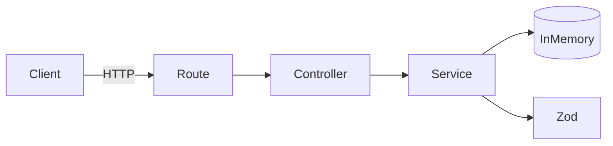

# 🚀 Pharma Stock Manager

Mini-projet backend simulant un système de gestion de stock pour des pharmacies.

> 🎯 Objectif : démontrer une approche **propre, testée et orientée métier** du développement backend.

---

## 🧠 Contexte

Ce projet s’inspire de problématiques réelles :

- 💊 Anticipation des ruptures de stock
- ⏳ Suivi des dates de péremption
- 📊 Fiabilité des données critiques

➡️ L’objectif est de reproduire un **socle technique réaliste**, proche d’un produit utilisé en production.

---

## 🛠️ Stack

### Backend

- Node.js
- TypeScript
- Express
- Zod (validation)
- Vitest (tests)
- Supertest (tests API)

---

## ✨ Fonctionnalités

### 🟢 Health check

GET /health

---

### ➕ Création d’un médicament

POST /medicines

Exemple :

    {
      "name": "Doliprane",
      "stock": 100,
      "threshold": 10,
      "expirationDate": "2026-01-01"
    }

---

### 📦 Liste des médicaments

GET /medicines

---

### 🚨 Alertes métier

GET /medicines/alerts

Un médicament peut avoir plusieurs alertes :

- 🔴 OUT_OF_STOCK
- 🟠 LOW_STOCK
- 🟡 EXPIRING_SOON
- ⚫ EXPIRED

➡️ Un médicament peut cumuler plusieurs états (réalité métier).

---

## 🏗️ Architecture

### Vue simplifiée

Requête HTTP → Route → Controller → Service → Données

---

### Diagramme

---

### Explication

- **Routes** → mapping HTTP
- **Controllers** → gestion requêtes
- **Services** → logique métier
- **Schemas** → validation
- **Store** → données (en mémoire)

➡️ Objectif : **séparation claire des responsabilités**

---

## 🧪 Tests

Tests d’intégration API :

- ✔ validation des endpoints
- ✔ règles métier
- ✔ cas invalides
- ✔ scénarios réalistes

➡️ Les données sont reset entre chaque test.

---

## ⚙️ Choix techniques

- TypeScript → sécurité & lisibilité
- Zod → validation centralisée
- séparation controller/service → testabilité
- in-memory → simplicité & focus métier

---

## ▶️ Lancer le projet

    cd backend
    npm install
    npm run dev

---

## 🧪 Lancer les tests

    cd backend
    npm run typecheck
    npm run test

---

## 🔁 Version Node

Utilise `.nvmrc` :

    nvm use

---

## 🚀 Améliorations possibles

- PostgreSQL
- Authentification
- Pagination / filtres
- CI/CD (GitHub Actions)
- Monitoring / logs
- Frontend React

---

## 🌍 Vision produit

Ce type de système permettrait :

- d’anticiper les ruptures
- de réduire les pertes
- d’améliorer le suivi patient
- d’aider à la décision

---

## 🎯 Objectif du projet

Montrer :

- 🧩 structuration backend
- 🧪 approche orientée qualité
- 🧠 compréhension métier
- 📈 capacité d’évolution

---

## 💡 Points forts

- Architecture claire
- Tests solides
- Logique métier réaliste
- Code lisible et évolutif

---

> 💥 Projet conçu pour être **présentable en entretien** et démontrer des compétences concrètes.
