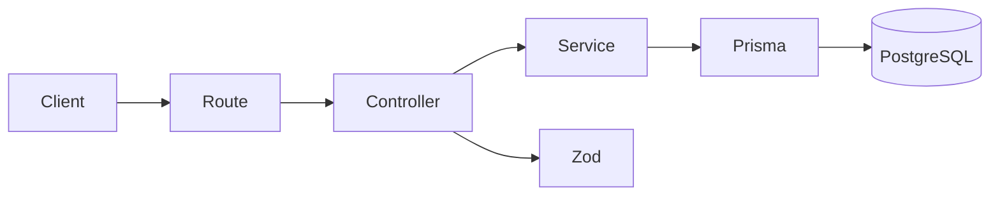

# 🚀 Pharma Stock Manager

[]()
[]()
[]()

Backend project simulating a pharmacy stock management system, designed to reflect **real-world production practices**.

> 🎯 Goal: showcase strong backend fundamentals, testing strategy, and production-ready architecture.

---

## 🧠 Business Context

Inspired by real pharmacy challenges:

- 💊 Prevent stock shortages
- ⏳ Track expiration dates
- 📊 Ensure data reliability

➡️ Focus: **business logic + engineering quality**

---

## 🛠️ Tech Stack

**Backend**

- Node.js + TypeScript
- Express
- Prisma ORM
- PostgreSQL (Supabase)
- Zod

**Testing**

- Vitest
- Supertest
- Docker (isolated DB)

**DevOps**

- GitHub Actions
- Vercel
- Docker

---

## ✨ API

### Health

GET /health

### Create medicine

POST /medicines

```json
{
  "name": "Doliprane",
  "stock": 100,
  "threshold": 10,
  "expirationDate": "2026-01-01"
}
```

### List

GET /medicines

### Alerts

GET /medicines/alerts

---

## 🏗️ Architecture



---

## 🧪 Testing Strategy

- Integration tests (no mocks)
- Real DB (Docker)
- Clean state per run
- Deterministic results

---

## ⚙️ CI Pipeline

- install
- typecheck
- prisma migrate
- test (Docker DB)
- build

➡️ Prevents broken code reaching main

---

## 🚀 Deployment

- Vercel
- Fails on TS errors
- Uses Supabase pooler

---

## ▶️ Run locally

```bash
cd backend
npm install
npm run dev
```

---

## 🧪 Run tests

```bash
npm run test
npm run test:integration
```

---

## 🔐 ENV

```
DATABASE_URL=...
```

---

## 💡 Technical Decisions

- No mocks → realism over speed
- Docker DB → isolation
- Prisma → type-safe queries
- Zod → runtime validation

---

## 📈 Next steps

- Auth (JWT)
- Pagination
- Monitoring
- Frontend

---

## 🎯 Takeaways

- Clean architecture
- Real DB testing
- CI/CD pipeline
- Production mindset

---

💥 Built to stand out in backend interviews
