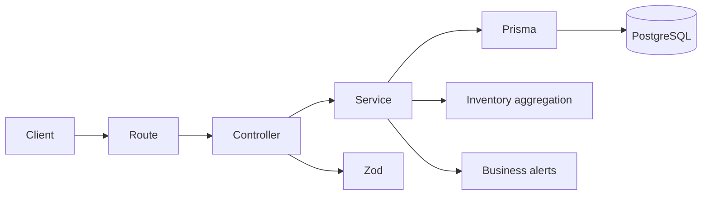

# 🚀 Pharma Stock Manager

[]()
[]()
[]()

Fullstack project simulating a pharmacy inventory management system, designed to reflect **real-world production practices**.

> 🎯 Goal: showcase strong backend fundamentals, domain modeling, testing strategy, CI/CD, and production-oriented architecture.

---

## 🧠 Business Context

This project is inspired by real pharmacy inventory challenges:

- 💊 Prevent medicine stock shortages
- ⏳ Track expiration dates per physical stock batch
- 📊 Ensure reliable inventory data for operational decisions
- 🚨 Detect stock and expiration risks early

➡️ Focus: **business logic + engineering quality**

---

## 🛠️ Tech Stack

**Backend**

- Node.js + TypeScript
- Express
- Prisma ORM
- PostgreSQL (Supabase)
- Zod

**Frontend**

- React
- Vite
- TypeScript
- CSS

**Testing**

- Vitest
- Supertest
- Docker (isolated PostgreSQL DB for integration tests)

**DevOps**

- GitHub Actions
- Vercel
- Docker

---

## 🧩 Domain Model

The inventory model is split into two main concepts:

### MedicineProduct

A `MedicineProduct` represents the medicine reference/catalog item.

Examples:

- Doliprane
- Ibuprofene
- Amoxicillin

A product contains:

- `id`
- `name`
- `threshold`
- timestamps

The `threshold` defines the minimum acceptable aggregated quantity before a low stock alert is triggered.

---

### MedicineBatch

A `MedicineBatch` represents a physical stock batch linked to a medicine product.

A batch contains:

- `id`
- `medicineProductId`
- `quantity`
- `expirationDate`
- timestamps

This design allows multiple batches for the same medicine product, each with its own quantity and expiration date.

Example:

```txt
Doliprane
├─ Batch 1: quantity 10, expires 2026-06-30
├─ Batch 2: quantity 25, expires 2026-09-15
└─ Batch 3: quantity 5, expires 2026-12-01
```

The inventory total quantity is computed from all batches linked to the same product.

---

## ✨ API

### Health

```http
GET /health
```

Response:

```json
{
  "status": "ok"
}
```

---

### Create medicine product

```http
POST /medicines/products
```

A medicine product represents the catalog/reference item.

Body:

```json
{
  "name": "Doliprane",
  "threshold": 10
}
```

Response:

```json
{
  "id": "uuid",
  "name": "doliprane",
  "threshold": 10,
  "createdAt": "...",
  "updatedAt": "..."
}
```

Notes:

- The name is normalized before persistence.
- The name is unique to avoid duplicate medicine references.
- Duplicate names return `409 Conflict`.

---

### List medicine products

```http
GET /medicines/products
```

Response:

```json
[
  {
    "id": "uuid",
    "name": "doliprane",
    "threshold": 10,
    "createdAt": "...",
    "updatedAt": "..."
  }
]
```

---

### Create medicine batch

```http
POST /medicines/products/:medicineProductId/batches
```

A batch represents a physical stock entry for an existing medicine product.

Body:

```json
{
  "quantity": 50,
  "expirationDate": "2026-06-30"
}
```

Response:

```json
{
  "id": "uuid",
  "medicineProductId": "uuid",
  "quantity": 50,
  "expirationDate": "2026-06-30T00:00:00.000Z",
  "createdAt": "...",
  "updatedAt": "..."
}
```

Notes:

- If the medicine product does not exist, the API returns `404 Not Found`.
- Batch quantity and expiration date are validated before persistence.

---

### Inventory

```http
GET /medicines/inventory
```

Returns medicine products with their batches and aggregated quantity.

Example response:

```json
[
  {
    "id": "uuid",
    "name": "doliprane",
    "threshold": 10,
    "createdAt": "...",
    "updatedAt": "...",
    "batches": [
      {
        "id": "uuid",
        "medicineProductId": "uuid",
        "quantity": 5,
        "expirationDate": "2026-06-30T00:00:00.000Z",
        "createdAt": "...",
        "updatedAt": "..."
      }
    ],
    "totalQuantity": 5
  }
]
```

---

### Inventory alerts

```http
GET /medicines/inventory/alerts
```

Returns inventory with product-level and batch-level alerts.

Possible product alerts:

- `OUT_OF_STOCK`
- `LOW_STOCK`
- `EXPIRING_SOON`
- `EXPIRED`

Example response:

```json
[
  {
    "id": "uuid",
    "name": "doliprane",
    "threshold": 10,
    "totalQuantity": 5,
    "alerts": ["LOW_STOCK"],
    "batches": [
      {
        "id": "uuid",
        "medicineProductId": "uuid",
        "quantity": 5,
        "expirationDate": "2026-06-30T00:00:00.000Z",
        "alerts": ["EXPIRING_SOON"]
      }
    ]
  }
]
```

---

## 🚨 Alert Rules

### Product-level alerts

Product-level alerts are computed from aggregated inventory data.

| Alert           | Rule                                          |
| --------------- | --------------------------------------------- |
| `OUT_OF_STOCK`  | Total quantity equals `0`                     |
| `LOW_STOCK`     | Total quantity is below the product threshold |
| `EXPIRED`       | At least one linked batch is expired          |
| `EXPIRING_SOON` | At least one linked batch expires soon        |

### Batch-level alerts

Batch-level alerts are computed from each batch expiration date.

| Alert           | Rule                                 |
| --------------- | ------------------------------------ |
| `EXPIRED`       | Batch expiration date is in the past |
| `EXPIRING_SOON` | Batch expires in less than 30 days   |

The backend owns these business rules so that the frontend only displays computed data instead of duplicating domain logic.

---

## 🏗️ Architecture



### Responsibilities

**Routes**

- Expose API endpoints
- Map HTTP routes to controllers

**Controllers**

- Handle request/response lifecycle
- Validate payloads with Zod
- Convert business errors into HTTP responses

**Services**

- Contain business logic
- Create medicine products and batches
- Compute aggregated inventory
- Compute product-level and batch-level alerts

**Prisma**

- Provides type-safe database access
- Handles relationships between products and batches

**PostgreSQL**

- Stores persistent inventory data
- Supports production-like persistence

---

## 🧪 Testing Strategy

The backend uses integration tests with a real PostgreSQL database instead of mocking the persistence layer.

### Why real DB tests?

- Avoid false positives from mocks
- Validate real Prisma queries
- Validate migrations and relations
- Catch integration issues early
- Test API behavior close to production

### Test environment

- Docker starts an isolated PostgreSQL database
- Prisma migrations are applied before tests
- Database state is cleaned between tests
- Tests run deterministically

### Covered scenarios

- Product creation
- Duplicate product name handling
- Invalid product payloads
- Batch creation
- Batch creation with unknown product
- Invalid batch payloads
- Inventory aggregation
- Product-level alerts
- Batch-level alerts

---

## ⚙️ CI Pipeline

GitHub Actions validates pull requests before merge.

Pipeline steps:

1. Install dependencies
2. Generate Prisma client
3. Typecheck TypeScript
4. Start/use PostgreSQL test database
5. Run Prisma migrations
6. Run integration tests
7. Build project

➡️ This prevents broken code from reaching `main`.

---

## 🚀 Deployment

The project is deployed with Vercel.

### Backend deployment

- Backend is deployed as a Vercel serverless API
- Prisma client is generated during install/build
- Build fails on TypeScript errors
- Runtime connects to Supabase PostgreSQL

### Database

- Supabase PostgreSQL is used for persistence
- Separate databases can be used for development and production
- Vercel uses the Supabase pooler connection for runtime compatibility

### Frontend deployment

- Frontend is deployed as a separate Vercel project
- Vite builds static assets
- Preview deployments are available on pull requests

---

## ▶️ Run locally

### Backend

```bash
cd backend
npm install
npm run dev
```

### Frontend

```bash
cd frontend
npm install
npm run dev
```

---

## 🔐 Environment Variables

Backend `.env`:

```env
DATABASE_URL=your_database_url
```

For local integration tests, `.env.test` points to the Docker PostgreSQL database.

---

## 🧪 Run tests

### Backend tests

```bash
cd backend
npm run test
npm run test:integration
```

### Frontend tests

```bash
cd frontend
npm run test
npm run typecheck
```

---

## 🧱 Prisma

Common commands:

```bash
cd backend
npx prisma generate
npx prisma migrate dev
npx prisma migrate deploy
```

Use `migrate dev` while creating migrations locally.

Use `migrate deploy` to apply existing migrations to an environment.

---

## 💡 Technical Decisions

- Product / Batch split → closer to real pharmacy inventory
- Aggregated inventory endpoint → keeps business logic in the backend
- Batch-level alerts → supports expiration tracking per physical stock entry
- No mocks for integration tests → realism over speed
- Docker DB → isolated and reproducible tests
- Prisma → type-safe database access
- Zod → runtime validation at API boundaries
- Vercel preview deployments → safer release workflow
- Branch protection → prevents merging broken code

---

## 📈 Next Steps

Possible improvements:

- Improve frontend UX for product and batch creation
- Add detailed alert messages
- Add pagination and filtering
- Add authentication
- Add role-based access control
- Add monitoring/logging
- Add end-to-end tests with Playwright
- Add a richer inventory dashboard

---

## 🎯 Takeaways

This project demonstrates:

- Clean backend architecture
- Realistic domain modeling
- Real database persistence
- Prisma/PostgreSQL integration
- Docker-based integration testing
- CI/CD pipeline
- Vercel deployment
- Production-oriented thinking

---

💥 Built to stand out in backend and fullstack interviews.
